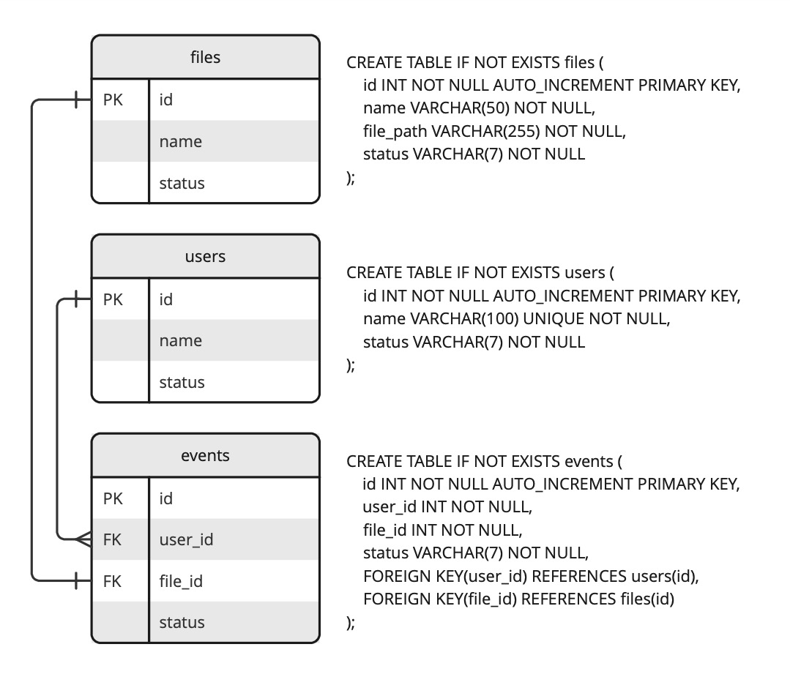

# Модуль 2.4: HTTP + Сервлеты

### Задача 

Необходимо реализовать REST API, которое взаимодействует с файловым хранилищем и предоставляет возможность получать доступ к файлам и истории загрузок.

**Исходные данные**

Сущности:
* User -> Integer id, String name, List<Event> events
* Event -> Integer id, User user, File file
* File -> Integer id, String name, String filePath

Требования:
* Все CRUD операции для каждой из сущностей
* Придерживаться подхода MVC
* Для сборки проекта использовать Maven
* Для взаимодействия с БД - Hibernate
* Для конфигурирования Hibernate - аннотации
* Инициализация БД должна быть реализована с помощью flyway
* Взаимодействие с пользователем необходимо реализовать с помощью Postman

Технологии: Java, MySQL, Hibernate, HTTP, Servlets, Maven, Flyway, Swagger.

### Элементы реализации

**Организация базы данных**

**Организация REST API**

**FILES**

GET http://localhost:8080/api/v1/files - get JSON displaying all files 

GET http://localhost:8080/api/v1/files/{id} - get JSON file by ID

POST http://localhost:8080/api/v1/files + JSON - create new file via POSTing a real file to this endpont

DELETE http://localhost:8080/api/v1/files/{id} - delete file by id

PUT http://localhost:8080/api/v1/files + JSON - update file using JSON

**USERS**

GET http://localhost:8080/api/v1/users - get JSON with all users

GET http://localhost:8080/api/v1/users/{id} - get JSON-user by ID

POST http://localhost:8080/api/v1/users + JSON - create new user via POSTing a JSON-user to this endpont

DELETE http://localhost:8080/api/v1/users/{id} - delete user by id

PUT http://localhost:8080/api/v1/users + JSON - update user using JSON

**EVENTS**

GET http://localhost:8080/api/v1/events - get JSON displaying all events 

GET http://localhost:8080/api/v1/events/{id} - get JSON-event by ID

POST http://localhost:8080/api/v1/events - not allowed

DELETE http://localhost:8080/api/v1/events/{id} - delete event by id

PUT http://localhost:8080/api/v1/events - not allowed
